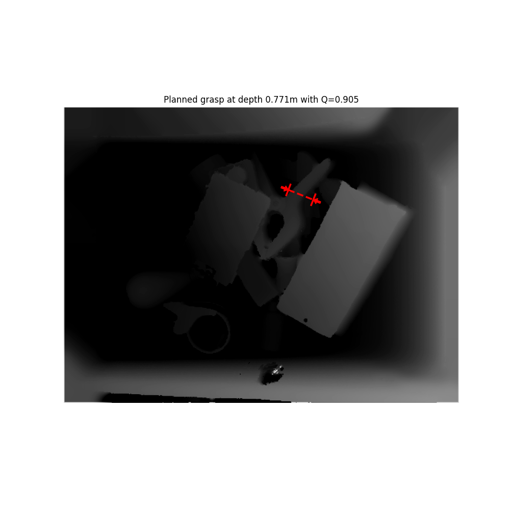
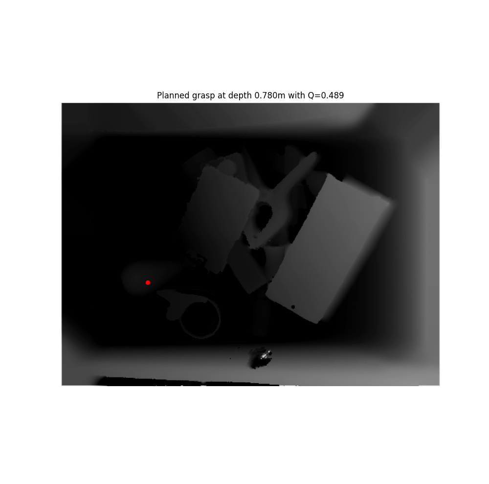

# Dex-Net

The homepage of Dex-Net is [here](https://berkeleyautomation.github.io/dex-net/), and the installation document is [here](https://berkeleyautomation.github.io/dex-net/code.html).

Dexterity Network (DexNet) was first proposed in 2016, it includes a 3D dataset, a. The sampling method used in Dex-Net 1.0 was proposed in [6], it's a geometrical method to generate two points for gripping with a 2D polygonal slice of the object.
## Dexterity Network (DexNet) 1.0
## Dexterity Network (DexNet) 2.0
## Dexterity Network (DexNet) 3.0
## Dexterity Network (DexNet) 4.0

## [GQ-CNNs](https://berkeleyautomation.github.io/gqcnn/)
 Grasp Quality Convolutional Neural Networks (GQ-CNNs) is first proposed in Dex-Net 2.0 [2],

### install GQ-CNNs
Here we install GQ-CNNs without ROS, if you want install a ROS package, see [here](https://berkeleyautomation.github.io/gqcnn/install/install.html#ros-installation).

Clone the repository
```
git clone https://github.com/BerkeleyAutomation/gqcnn.git
```
As the [official website](https://berkeleyautomation.github.io/gqcnn/install/install.html#) mentions "Several users have encountered problems with dependencies when using Conda", here we use pip virtual environment ``venv``.

```
# install venv
sudo apt-get install python3-venv

# Creating a virtual environment
python3 -m venv gqcnn

# activate
source gqcnn/bin/activate

# confirm in the virtual environment by checking the location
which python

# deactivate
deactivate

```

Then install GQ-CNNs, change directories into the gqcnn repository and run the pip installation in your virtual environment.
```
pip install .

```

### Grasp planning
Use  a pre-trained model for grasp planning with RGBD images.
#### Prerequisites
Download the example models and datasets:
```
$ cd /path/to/your/gqcnn
$ ./scripts/downloads/download_example_data.sh
$ ./scripts/downloads/models/download_models.sh
```
#### tutorials
To evaluate the pre-trained Dex-Net 4.0 parallel jaw network on sample images of objects in heaps run:
```
python examples/policy.py GQCNN-4.0-PJ --depth_image data/examples/clutter/phoxi/dex-net_4.0/depth_0.npy --segmask data/examples/clutter/phoxi/dex-net_4.0/segmask_0.png --camera_intr data/calib/phoxi/phoxi.intr
```
<p align="center"></p>
<p align="center">Figure 1. Result for parallel jaw</p>

To evaluate the pre-trained Dex-Net 4.0 suction network on sample images of objects in heaps run:

```
$ python examples/policy.py GQCNN-4.0-SUCTION --depth_image data/examples/clutter/phoxi/dex-net_4.0/depth_0.npy --segmask data/examples/clutter/phoxi/dex-net_4.0/segmask_0.png --camera_intr data/calib/phoxi/phoxi.intr

```
<p align="center"></p>

<p align="center">Figure 2. Result for suction cup</p>

#### issue
##### issue 1
If you have error as below:
> Command "python setup.py egg_info" failed with error code 1 in /tmp/pip-build-oy2sykf6/rtree/

this means there are some trouble of installing ``rtree``, as rtree requires ``libspatialindex``, install [libspatialindex](https://libspatialindex.org/index.html):
```
# download
https://github.com/libspatialindex/libspatialindex/releases/download/1.9.3/spatialindex-src-1.9.3.tar.gz
# unzip and change directories into the folder
# build a folder for compiling
mkdir build
cd build
cmake ..
make -j4
sudo make install
```
After intsalling, add the library path to ~/.bashrc as below:    
``export LD_LIBRARY_PATH="/usr/local/lib/":$LD_LIBRARY_PATH``

##### issue 2
If you have some trouble to download models and data with commands
```
$ ./scripts/downloads/download_example_data.sh
$ ./scripts/downloads/models/download_models.sh
```
use a VPN to download them.

##### issue 3
If you have error as below:
> Matplotlib is currently using agg, which is a non-GUI backend, so cannot show the figure.

 install ``tkinter``, then you will see the figure.

```
 sudo apt-get install python3-tk
```

## References
[1] Mahler J, Pokorny F T, Hou B, et al. Dex-net 1.0: A cloud-based network of 3d objects for robust grasp planning using a multi-armed bandit model with correlated rewards[C]//2016 IEEE international conference on robotics and automation (ICRA). IEEE, 2016: 1957-1964.

[2] Mahler J, Liang J, Niyaz S, et al. Dex-net 2.0: Deep learning to plan robust grasps with synthetic point clouds and analytic grasp metrics[J]. arXiv preprint arXiv:1703.09312, 2017.

[3] Mahler J, Matl M, Liu X, et al. Dex-Net 3.0: Computing robust vacuum suction grasp targets in point clouds using a new analytic model and deep learning[C]//2018 IEEE International Conference on Robotics and Automation (ICRA). IEEE, 2018: 1-8.

[4] Mahler J, Matl M, Satish V, et al. Learning ambidextrous robot grasping policies[J]. Science Robotics, 2019, 4(26): eaau4984.

[5] Mahler J, Goldberg K. Learning deep policies for robot bin picking by simulating robust grasping sequences[C]//Conference on robot learning. 2017: 515-524.

[6] Smith G, Lee E, Goldberg K, et al. Computing parallel-jaw grips[C]//Proceedings 1999 IEEE International Conference on Robotics and Automation (Cat. No. 99CH36288C). IEEE, 1999, 3: 1897-1903.
