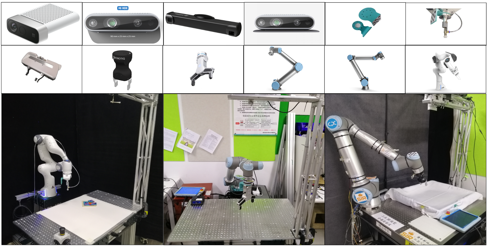

# Robot Library

The DeepClaw cell, shown on the bottom of the following figure, is a self-contained robot cell for manipulation tasks, including an assembled station, a robot arm, a robot end-effector, a visual sensor. Thanks to the standardized design, we are able to buy the components and assemble the robot station quickly. The hardware setup is defined in the software part of DeepClaw through configuration files. The same task should be easily reproduced on different hardware setups if the configuration file is adequately defined. 

The supported hardware are listed below
| Arm (Manipulator)       | Hand (Gripper) | Eye (Camera)             | Accessory (Sensor) |
|-------------------------|----------------|--------------------------|--------------------|
| Universal Robots: UR10e | Robotiq: HandE | Intel: Realsense D435   *|                    |
| Universal Robots: UR5   | OnRobot: RG6   | Microsoft: Kinect Azure *|                    |
| Franka Emika: Panda    *|                |                          |                    |

**Note**: `The drivers with (*) mark require extra installation steps in addition to the installation of deepclaw. Please go to the correspongding folders and follow the detailed instruction there`.

## Arm (Manipulator)

### Universal Robots: UR10e

### Universal Robots: UR5

### Franka Emika: Panda

### AUBO: i5 (TODO)

### Denso: Cobotta (TODO)

### Yaskawa: MotoMini (TODO)

## Hand (Gripper)

### Robotiq: HandE

### OnRobot: RG6 (TODO)

### Customized: Suction (TODO)

## Eye (Camera)

### Intel: Realsense D435

### Intel: Realsense D435i (TODO)

### Microsoft: Kinect Azure

### Microsoft: Kinect V2 (TODO)

### Photoneo: Model M (TODO)

## Accessory (Sensor)

### OnRobot: Force-Torque Sensors (TODO)

### ATI: nano17 (TODO)

## DeepClaw Stations with UR10e (TODO)

### UR10e+HandE+D435 (TODO)

### UR10e+HandE+Azure (TODO)

### UR10e+HandE+PhotoM (TODO)

## DeepClaw Stations with UR5 (TODO)

### UR5+RG6+D435 (TODO)

## DeepClaw Stations with Franka (TODO)

### Franka+2Finger+D435 (TODO)

## DeepClaw Stations with MotoMini (TODO)

### MotoMini+Suction+D435 (TODO)

## DeepClaw Stations with Cobotta (TODO)

### Cobotta+2Finger+D435 (TODO)

## DeepClaw Stations with AUBOi5 (TODO)

### AUBOi5+Suction+D435 (TODO)
